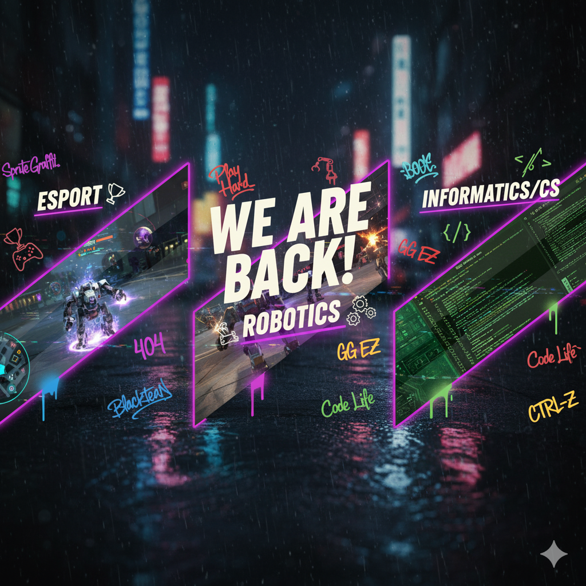
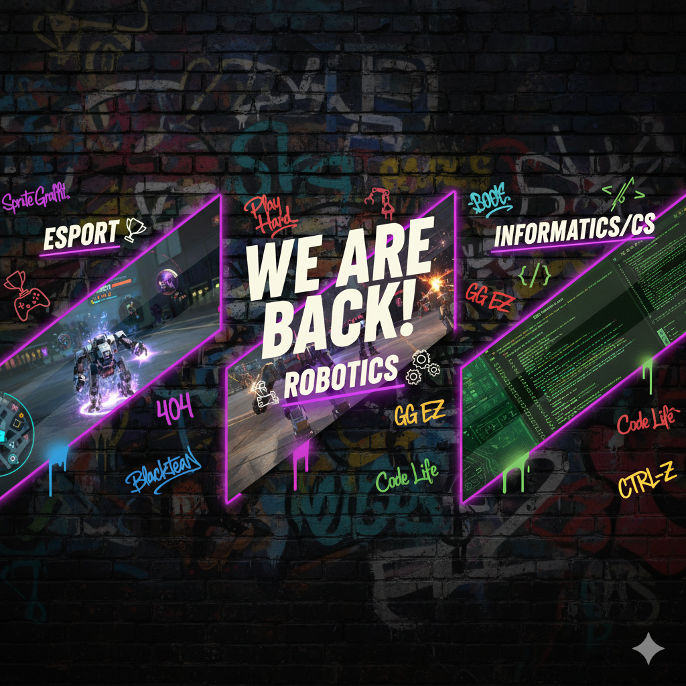

# Extracurricular Social Media Relaunch Concept

## 🎯 Core Idea
- Theme: **Bold urban graffiti × Persona 5 × NFS Unbound aesthetic**
- Vibe: Hype, youthful, rebellious but still structured and readable
- Purpose: Announce that the extracurricular (Esport, Robotics, Informatics/CS) is **active again on social media**
- [Design on Canva](https://www.canva.com/design/DAG0Mpb2S5c/hyt_8yygyfRG_rgfy73qdw/edit?utm_content=DAG0Mpb2S5c&utm_campaign=designshare&utm_medium=link2&utm_source=sharebutton)

---

## 🖋 Typography System
- **Tier 1 (Main Headers)** → Anton  
  - Example: **WE ARE BACK!**
  - Usage: Loud announcements, event titles
- **Tier 2 (Subheaders)** → Bebas Neue / Bebas Neue Cyrillic  
  - Example: **ESPORT / ROBOTICS / INFORMATICS/CS**
  - Usage: Secondary structure, categories
- **Tier 3 (Decorative Accents)** → Graffiti / Brush fonts  
  - Fonts: Sprite Graffiti, Blacktean, Lifelogo, City Lights, Seashore, Beast, Bright Sunshine  
  - Usage: Tags, random stickers, accents around main text

---

## 🎨 Color Palette
- **Background**: `#000000` (pure black)  
- **Main Text**: `#e4e2dd` (off-white, softer than pure white)  
- **Graffiti Accent Palette (muted but lively)**:  
  - Pink: `#ff4fa1`  
  - Blue: `#3cb7ff`  
  - Green: `#42ff73` 
  - Red/Orange: `#ff5c36`  
  - Yellow: `#ffd447`  
  - Purple: `#9b59ff`  
  - Off-white: `#e4e2dd` (filler tags for balance)
    * The full one is available on graffiti.md

👉 Usage:  
- 70% = off-white graffiti  
- 20% = one or two accent colors  
- 10% = experimental splashes  

---

## 📐 Canvas Layout
- **Size**: 3240×1080 px (3×1 for Instagram grid, each slice 1080×1080)  
- **Center panel**: “WE ARE BACK!” in Anton, off-white  
- **Left panel**: Subheader “ESPORT” + gaming graffiti + controller icons  
- **Center bottom**: Subheader “ROBOTICS” + gear/robot arm icons  
- **Right panel**: Subheader “INFORMATICS/CS” + code bracket doodles  
- **Graffiti placement**: scattered diagonally, edges, partial cutoffs (like stickers)  
- **Optional diagonal strip overlays**: selection-screen style, each showing real feature (Esport gameplay, Robotics demo, Informatics coding scene)

---

## 🏷 Word Bank (Graffiti Tags)

### 🤖 Robotics / Informatics
BOTZ · AI · CTRL-Z · DEBUG · 404 · CODE LIFE · <HELLO WORLD> · SYNC · UPLOAD · GLITCH · //COMMENT · RUN() · ERROR · BYTE · { } · >_

### 🎮 Esport
CLUTCH · GG EZ · ONE TAP · RUSH B · REKT · NT · POG · FRAG · META · HP+ · XP++ · QUEUE · RESPAWN · MVP · FTW · PATCHED

### 🌐 General / Hype
BACK · ACTIVE · BOOM · HYPE · PLAY HARD · ALL IN · VIBES · CHAOS · LEGACY · LEVEL UP · LOADING… · UPGRADE · FLOW · NO LIMITS · GRIT

### 💻 Programming / CS
DEBUG · PUSH · PULL · MERGE · COMMIT · BRANCH · FORK · ALGO · O(N) · STACK · HEAP · LOOP · IF/ELSE · RETURN 0; · SYS32 · NULL · BOOL · VAR · CLASS · FUNC() · IMPORT · EXPORT · INIT · BUILD · RUN() · EXIT · SHELL · ROOT · CHMOD · SUDO · PWNED · HACK · SYSOP · QUERY · DB · CACHE · CLONE · GIT

---

## ⚡ Design Rules
1. **Hierarchy first** → Bold Anton/Bebas anchors info, graffiti never competes.  
2. **Graffiti limited** → 1–2 tags per panel, rotated from word bank.  
3. **Colors disciplined** → Mostly off-white + one or two accents, avoid rainbow chaos.  
4. **Icons tie identity** → Esport = controllers/headset, Robotics = gears/robot arm, Informatics = code brackets/terminals. ([source](https://www.svgrepo.com/)) 
5. **Background muted** → Rainy cyberpunk neon street (blurred/darkened), focus always on text. ([source](https://stockcake.com/i/neon-rain-reflection_126555_14056))

---

## 📣 Messaging Examples
- **Main header**: “WE ARE BACK!”  
- **Subheader**: “Extracurricular active again on socials”  
- **Tagline**: “Esport · Robotics · Informatics/CS — all in.”  
- **Graffiti add-ons**: “BOTZ”, “GG EZ”, “DEBUG”, “PLAY HARD” 

# 📲 Instagram Post Concept (3×1 Split)
## Post 1 — Robotics 🤖  
"Dari gear sampai ngoding, kita bikin robot yang makin gokil. 🤖  
Robotics balik lagi di feed kamu. Tungguin update, demo, sama behind-the-scenes seru dari lab kita! #BOTZ #RoboticsLife"  

---

## Post 2 — Esport 🎮  
"Kita balik aktif! 🚀  
Akun ini udah online lagi. Mulai dengan Esport, dari scrim, turnamen, highlight sampai epic fail. Stay tuned! 🎮  
#GG #EsportVibes"  

---

## Post 3 — Programming 💻  
"Hello World 👋  
Ngoding, solving problem, sampai debugging tengah malam. Informatika balik lagi bawa update project, tutorial, dan meme yang cuma anak dev ngerti. 💻  
#CodingLife #Informatics #WeCode"

# CONCEPT
Concept 1: Wet Asphalt Reflecting Neon Lights City Night Raining
- [link 1](https://www.dreamstime.com/photos-images/wet-asphalt-reflecting-neon-lights-city-night-rain-falling.html)
- [link 2](https://www.google.com/search?tbnid=gf84cyaVGY2HlM&tbnh=0&tbnw=0&sca_esv=229f5e211f1b8dd0&lns_surface=19&authuser=0&biw=2560&bih=1315&cs=1&sxsrf=AE3TifPVoilZvwcr43vq9t9w00h4NWINow:1759001785734&udm=44&source=lns.web.gisivli&vsdim=297,170&gsessionid=fDnFD54wbqL1-Ba9_YXKpqdBwLj3CQvt6jNGjL_kS8Jz00z1sdN7XQ&lsessionid=jNNFE6oyUZvosXCBfGYFjv2XrS8YoqsJoQGxbCaqGQs_F25HfLK3xw&vsint=CAQqCgoCCAcSAggSIAE6IwoWDQAAAD8VAAAAPx0AAIA_JQAAgD8wARCgBhjJAyUAAIA_&lns_mode=mu&q=free+wallpaper&sa=X&ved=2ahUKEwjVj-Sk2PmPAxWN1jgGHR7RNX4Qs6gLegQIEhAB&vsrid=CPKIucigvZS5pwEQBRgBIiRGM0VFQjNCRi0yMTdCLTRDRDktQUQxOC1FNTYxOTUwRjg3QzMyBiICc2woIDif29n51_mPAw)

Concept 2: Bold urban graffiti × Persona 5 × NFS Unbound aesthetic

Concept 3: Prototype (Gemini)

# RESULT
Result:

# CREDIT
- Theme and Concept: Kemtan
- Logo: 
- Ideas and help: ITNC and Friends